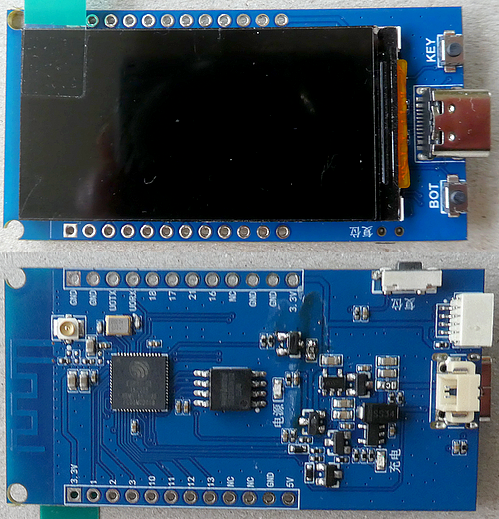
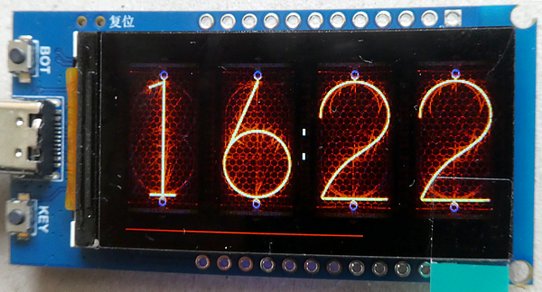
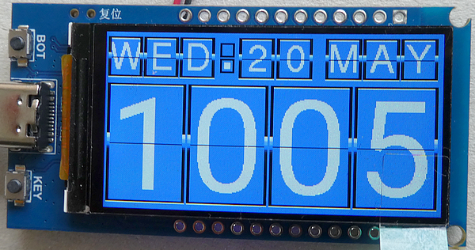
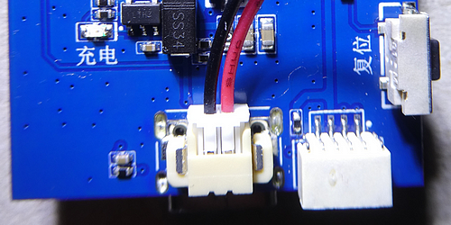
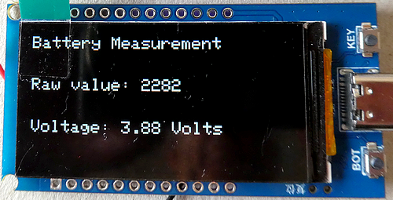

# ESP32-S3 1,9 inch ST7789 TFT Display

By chance, I was able to figure out the correct pin assignments for the TFT display on the ESP32-S3 development board and use them to create a Nixie-style clock.

This repository accompanies the articles "**How do I find the correct connection pins for an ESP32-S3 development board with an attached TFT display (ST7789)?**" published here: https://medium.com/@androidcrypto/how-do-i-find-the-correct-connection-pins-for-an-esp32-s3-development-board-with-an-attached-tft-eb4bbbbac95b

and "**Create a Stylish Flip Clock on an ESP32-S3 Development Board with a 1.9-inch TFT Display**": https://medium.com/@androidcrypto/create-a-stylish-flip-clock-on-an-esp32-s3-development-board-with-a-1-9-inch-tft-display-47b0496e4fcf



### Pin Assignments

````plaintext
TFT Display:
TFT-Backlight: GPIO 38 (HIGH = ON)
TFT-Power    : GPIO 15 (HIGH = ON)
TFT-CS       : GPIO  6
TFT-MOSI     : GPIO  9 // = SDA
TFT-SCLK     : GPIO  8   
TFT-MISO     : GPIO 13 // Not connected
TFT-DC       : GPIO  7
TFT-RST      : GPIO  5

Buttons:
Boot Button  : GPIO 0
Key Button   : GPIO 14

QWIIC Connector seen from back side from left to right:
1 GND
2 3.3 V
3 GPIO 43 (labled U0TX)
4 GPIO 44 (labled U0RX)

Battery Voltage measurement: GPIO  4
````



### Nixie-style clock on the ESP32-S3 1,9 inch TFT display ST7789 170 x 320 pixel

- Nixie sketch: **[Esp32_S3_ST7789_1_9_NixieClock_v07](./Esp32_S3_ST7789_1_9_NixieClock_v07)** folder

### Flip-style clock clock on the ESP32-S3 1,9 inch TFT display ST7789 170 x 320 pixel

- Flip clock sketch: **[Esp32_S3_LovyanGFX_1_9_ST7789_FlipClock_v05](./Esp32_S3_LovyanGFX_1_9_ST7789_FlipClock_v05)** folder



### Battery voltage measurement

- Sketch: **[Esp32_S3_ST7789_1_9_BatteryMeasurement_v01](./Esp32_S3_ST7789_1_9_BatteryMeasurement_v01)** folder

Connect the battery with this polarity:





## Development Environment (Arduino)
````plaintext
Arduino IDE Version 2.3.8 (Windows)
arduino-esp32 boards Version 3.3.8 (https://github.com/espressif/arduino-esp32) that is based on Espressif ESP32 Version 5.5.1
````
